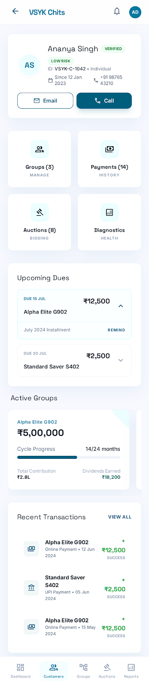
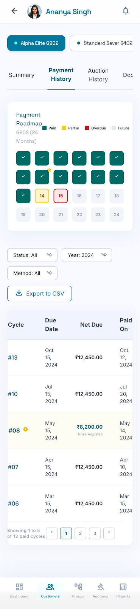

<p align="center">
  
</p>

<h1 align="center">VSYK Chits</h1>

<p align="center">
  A full-stack mobile platform for managing chit funds — member app + admin dashboard, built with Expo and Supabase.
</p>

<p align="center">
  <strong>Expo SDK 54</strong> · <strong>React Native</strong> · <strong>Supabase</strong> · <strong>Express</strong>
</p>

---

## Overview

VSYK Chits is a digital chit fund management app with two experiences in one codebase:

| Role | What they do |
|------|--------------|
| **Members** | View chits, pay installments, join live auctions, manage wallet & profile |
| **Admins** | Manage customers, groups, live auctions, settlements, reports & settings |

Data flows through **Supabase** (auth, database, realtime) with an **Express backend** handling Razorpay payments, push notifications, and auction automation.

---

## Screenshots

<table>
  <tr>
    <td align="center">
      
      <br /><sub>Admin — Customer Hub</sub>
    </td>
    <td align="center">
      
      <br /><sub>Admin — Groups Detail</sub>
    </td>
    <td align="center">
      
      <br /><sub>Member App</sub>
    </td>
  </tr>
</table>

---

## Features

### Member App (`Frontend/app/(tabs)/`)

| Tab | Capabilities |
|-----|-------------|
| **Home** | Dashboard with active chits, dues, and quick actions |
| **Chits** | Browse groups, view chit details, payment history, prize payouts |
| **Auctions** | Join live auctions, place bids, view results in realtime |
| **Wallet** | Payment history, Razorpay checkout, partial payments |
| **Profile** | KYC, nominees, foreclosure, insights, language (i18n) |

### Admin Panel (`Frontend/app/(admin)/`)

| Section | Capabilities |
|---------|-------------|
| **Dashboard** | Collection analytics, KPI charts |
| **Customers** | Full customer hub — overview, groups, payments, auctions, diagnostics |
| **Groups** | Create/manage chit groups, members, unaccounted chits |
| **Auctions** | Schedule auctions, live bidding monitor, winner settlement |
| **Reports** | Financial reports and exports |
| **Settings** | App configuration |

### Backend Services (`Backend/src/`)

| Endpoint | Purpose |
|----------|---------|
| `GET /api/health` | Health check |
| `POST /api/payments/razorpay/order` | Create Razorpay payment order |
| `POST /api/payments/razorpay/verify` | Verify payment signature |
| `POST /api/auctions/scheduler/run` | Run auction scheduler |
| `POST /api/auctions/notify-winner` | Push notification to auction winner |
| `POST /api/auctions/notify-installments` | Notify members of installment dues |
| `POST /api/auctions/notify-upcoming` | Upcoming auction reminders |
| `POST /api/auctions/apply-settlement` | Apply prize settlement to ledger |

---

## Tech Stack

| Layer | Technology |
|-------|-----------|
| Mobile | Expo 54, React Native 0.81, Expo Router |
| Styling | NativeWind (Tailwind CSS) |
| State | TanStack Query, Zustand |
| Backend | Express 5, TypeScript |
| Database | Supabase (PostgreSQL + Realtime + Auth) |
| Payments | Razorpay |
| Notifications | Expo Notifications + Firebase Cloud Messaging |
| i18n | i18next (English + Tamil) |

---

## Project Structure

```
VSYK_APP/
├── Frontend/                    # Expo React Native app
│   ├── app/
│   │   ├── (auth)/              # Login, onboarding
│   │   ├── (tabs)/              # Member screens
│   │   └── (admin)/             # Admin screens
│   ├── components/              # Shared UI components
│   ├── lib/                     # Supabase, API, hooks, i18n
│   ├── assets/                  # Logos, icons, splash
│   └── supabase/migrations/     # 33 SQL migration files
├── Backend/
│   └── src/
│       ├── server.ts            # Express API + notifications
│       └── config/supabase.ts   # Supabase admin client
└── docs/                        # All project documentation
    ├── architecture/
    ├── features/
    ├── bug-fixes/
    ├── integrations/
    ├── roadmap/
    ├── design/
    ├── images/                  # Screenshots & mockups
    └── prompts/                 # AI dev prompts
```

---

## Quick Start — Expo Go

### Prerequisites

- [Node.js](https://nodejs.org/) 18+
- [Expo Go](https://expo.dev/go) on your phone
- Supabase project (URL + anon key)

### 1. Clone & setup Frontend

```bash
git clone https://github.com/kirankishoreV-07/VSYK_APP.git
cd VSYK_APP/Frontend
cp .env.example .env
```

Edit `.env`:

```env
EXPO_PUBLIC_SUPABASE_URL=https://your-project.supabase.co
EXPO_PUBLIC_SUPABASE_ANON_KEY=your_anon_key
EXPO_PUBLIC_API_URL=http://YOUR_LAN_IP:5000
```

```bash
npm install
npx expo start
```

Scan the QR code with **Expo Go**.

**Share with testers on a different network:**

```bash
npx expo start --tunnel
```

### 2. Start Backend (optional, for payments & push)

```bash
cd ../Backend
cp .env.example .env
# Fill in Supabase, Razorpay, and FCM credentials
npm install
npm run dev
```

> On a physical device, set `EXPO_PUBLIC_API_URL` to your machine's LAN IP (e.g. `http://192.168.1.10:5000`), not `localhost`.

### 3. Database Migrations

Apply SQL files from `Frontend/supabase/migrations/` in your Supabase SQL Editor (001 → 033 in order), or use the Supabase CLI.

---

## Environment Variables

### Frontend (`Frontend/.env`)

| Variable | Description |
|----------|-------------|
| `EXPO_PUBLIC_SUPABASE_URL` | Supabase project URL |
| `EXPO_PUBLIC_SUPABASE_ANON_KEY` | Supabase public/anon key |
| `EXPO_PUBLIC_API_URL` | Backend API base URL |

### Backend (`Backend/.env`)

| Variable | Description |
|----------|-------------|
| `PORT` | Server port (default `5000`) |
| `SUPABASE_URL` | Supabase project URL |
| `SUPABASE_ANON_KEY` | Supabase anon key |
| `SUPABASE_SERVICE_ROLE_KEY` | Service role key (server-side) |
| `RAZORPAY_KEY_ID` | Razorpay test/live key |
| `RAZORPAY_KEY_SECRET` | Razorpay secret |
| `FCM_SERVICE_ACCOUNT_JSON` | Firebase service account (push notifications) |

Copy from `.env.example` in each folder — never commit real `.env` files.

---

## Scripts

| Location | Command | Description |
|----------|---------|-------------|
| `Frontend/` | `npm start` | Start Expo dev server |
| `Frontend/` | `npm run android` | Open on Android emulator |
| `Frontend/` | `npm run ios` | Open on iOS simulator |
| `Backend/` | `npm run dev` | Start API with hot reload |
| `Backend/` | `npm run build` | Compile TypeScript |
| `Backend/` | `npm start` | Run compiled server |

---

## Documentation

All docs are in the [`docs/`](docs/) folder:

| Section | Contents |
|---------|----------|
| [Architecture](docs/architecture/) | Component trees, feature audits, realtime status |
| [Features](docs/features/) | Auctions, groups, payments, unaccounted chits |
| [Bug Fixes](docs/bug-fixes/) | Resolved payment & realtime issues |
| [Integrations](docs/integrations/) | WhatsApp notification plans |
| [Roadmap](docs/roadmap/) | Phase 2 plans, pending UI work |
| [Design](docs/design/) | Color system & design tokens |
| [Images](docs/images/) | UI mockups and screenshots |

See the full index: **[docs/README.md](docs/README.md)**

---

## License

Private — VSYK Chit Funds.